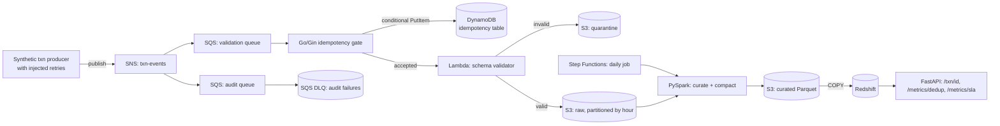

# Architecture

## Data flow notes

- The idempotency gate is the only synchronous, latency-sensitive hop. Everything downstream is asynchronous.
- The daily Step Functions job is what performs compaction — small files land in `S3RAW` all day, and get merged into fewer, larger Parquet files in `S3CUR` once per day.
- The quarantine bucket exists so a schema change never silently drops data — it's parked for replay once the schema registry entry is fixed.
