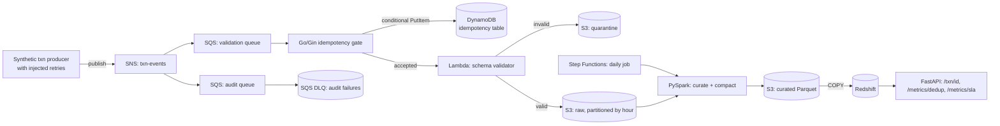

# Architecture

Flujo de ejecución de punta a punta (cómo corre `make demo` / el runbook) y el camino de datos.

En local, MiniStack emula SNS/SQS/S3/DynamoDB/Lambda/Step Functions en `:4566`. Redshift = DuckDB leyendo Parquet. El validator en el demo corre **in-process** (`consumer.py` llama `validator.handler`); en prod sería Lambda.

## ASCII — ejecución (`make demo`)

```
  [terminal]
       |
       v
  env.sh  +  docker compose (MiniStack :4566)  +  bootstrap.py
       |         buckets / queues / topic / DDB tables
       v
  data_gen.py ---------> data/events.jsonl
       |                   (N lines, ~8% retries = same idempotency_key)
       v
  publisher.py --------> SNS  txn-events
                            |  fan-out (raw delivery)
              +-------------+-------------+
              v                           v
   SQS txn-validation-queue      SQS txn-audit-queue
              |                           |
              |                           +--> DLQ txn-audit-dlq
              v                              (after maxReceiveCount)
   consumer.py  (poll)
              |
              |  POST /accept
              v
   Go/Gin gate :8080
              |
              |  DynamoDB PutItem
              |  Condition: attribute_not_exists(idempotency_key)
              |
         +----+----+
         |         |
       200        409 duplicate
         |         |
         |         +--> ACK SQS, no S3 write
         v
   validator.handler
         |
    +----+----+
    |         |
  valid     invalid
    |         |
    v         v
 S3 txn-raw   S3 txn-quarantine
  /valid/        (schema fail; parked for replay)
    |
    v
  statemachine.py
    |  Step Functions: preflight Lambda -> (driver runs Spark) -> postflight Lambda
    v
  curate.py (PySpark)
    |  compact small JSON -> Parquet
    v
 S3 txn-curated / txn_events/
    |
    v
  DuckDB  (stand-in Redshift / Spectrum)
    |
    v
  FastAPI  /txn/{id}  /metrics/dedup  /metrics/sla
```

## ASCII — un evento (hot path vs batch)

```
  PRODUCER                    HOT PATH (sync, ms)              BATCH (async, daily)
  --------                    -------------------              --------------------
  event + idempotency_key
           |
           |  SNS/SQS
           v
                      +------------------+
                      |  gate /accept    |
                      |  DDB conditional |
                      +--------+---------+
                               |
                    200        |        409
                     |         |         |
                     v         |         v
              schema check     |    drop (already stored)
                     |         |
              +------+------+  |
              |             |  |
           valid         invalid
              |             |
              v             v
           S3 raw      S3 quarantine
              |
              |  (hours of small files)
              v
         Step Functions
              |
              v
         PySpark compact
              |
              v
         S3 curated Parquet --> SQL (DuckDB / Redshift COPY)
```

## Mermaid (mismo flujo)



## Data flow notes

- The idempotency gate is the only synchronous, latency-sensitive hop. Everything downstream is asynchronous.
- The daily Step Functions job is what performs compaction — small files land in `S3RAW` all day, and get merged into fewer, larger Parquet files in `S3CUR` once per day.
- The quarantine bucket exists so a schema change never silently drops data — it's parked for replay once the schema registry entry is fixed.
- A DynamoDB conditional `PutItem` that loses (409) leaves **no row**; duplicate counts live in `txn-gate-metrics`, not inferred from the idempotency table.
